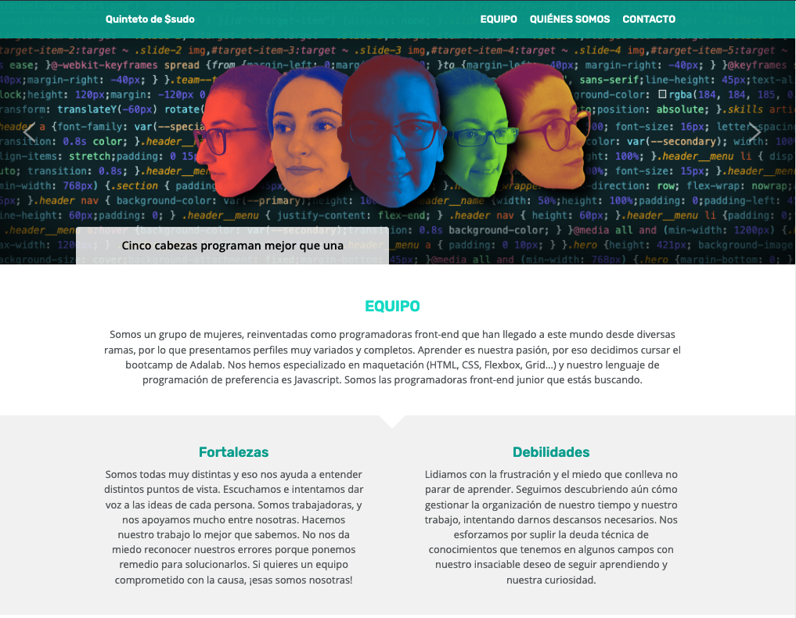
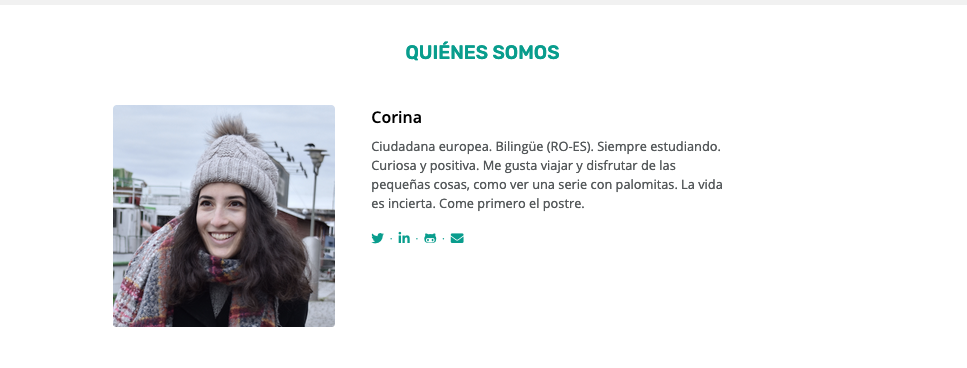
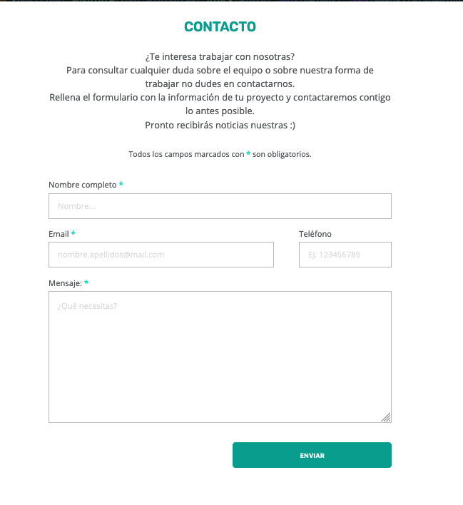

# Quinteto de sudo

En este proyecto de página web grupal presentamos a las integrantes de nuestro grupo **Quinteto de $sudo** para promocionarlas ante posibles clientes. Para ello nuestra página cuenta con una sección de introducción a las alumnas con links a sus redes sociales y profesionales y una sección de formulario para que los posibles clientes puedan contactar con nosotras.

## Tecnologías empleadas

| Maquetación                                                  | Automatización                             | Control de versiones                     |
| ------------------------------------------------------------ | ------------------------------------------ | ---------------------------------------- |
|  |  |  |

Toda nuestra página está maquetada en **HTML** y **CSS**. Para ello hemos utilizado **Sass** como preprocesador de CSS y **Gulp** para la automatización de tareas. Con respecto al control de versiones, hemos manejado **git** con soltura, creando diferentes ramas y experimentando con nuevas features, solventando conflictos (hard & soft!).

Nuestra visión ha sido de **mobile first**, adaptando el diseño a otros tamaños de pantallas. 

## Integrantes del grupo

## Partes de la página

La página principal `index.html` muestra información general sobre el equipo, nuestras fortalezas y debilidades, así como una sección dedicada a presentar a cada una de las alumnas brevemente y los métodos de contacto con cada una: github, twitter, instagram, linkedin. 

La página de `contacto.html`  consiste en un formulario funcional a través del cuál los clientes pueden comunicarse con el grupo. 

